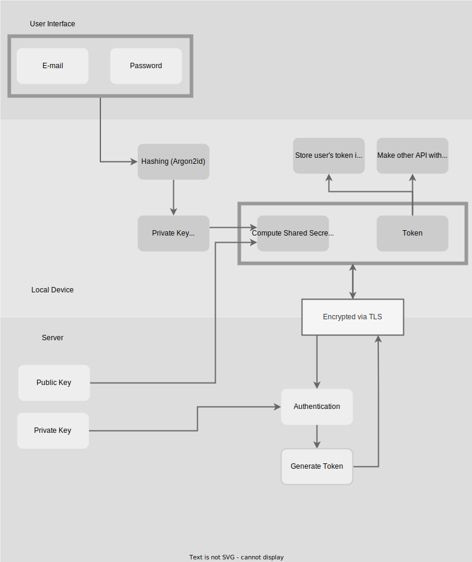

# Auth Endpoint

The `Auth` endpoint is designed to handle user authentication-related actions for the LibrePass application.
This includes user registration, login, two-factor authentication, password hint requests, email verification,
and other related functionalities.

## Authentication flow

A basic diagram that shows how authentication works.



## Endpoints

### Register

Create a new account and send a verification email.

**Endpoint:** `POST /api/auth/register`

**Request:**

```json
{
  "email": "string",
  "passwordHint": "string",
  "publicKey": "string",
  "sharedKey": "string",
  "parallelism": 3,
  "memory": 65535,
  "iterations": 4
}
```

**Where:**

- `email`: The user's email address.
- `passwordHint`: The user's password hint (optional).
- `publicKey`: The user's public key (x25519 public key). More information about a public key you can read [here](../crypto/cryptography.md#public-key).
- `sharedKey`: The shared key (x25519 shared key) exchanged between the user and the server. More information about a shared key you can read [here](../crypto/cryptography.md#user-authentication).
- `parallelism`: The argon2id parameter (Default is 3).
- `memory`: The argon2id parameter (Default is 64MiB).
- `iterations`: The argon2id parameter (Default is 4).

**Response:** Returns a standard response indicating the success or failure of the registration process.

### Pre-Login

Retrieve pre-login information, including argon2id parameters and the server's Curve25519 public key.

**Endpoint:** `GET /api/auth/preLogin`

**Query Parameters:**

- `email`: User's email for retrieving user-specific parameters (optional).

**Response:**

```json
{
  "parallelism": 3,
  "memory": 65536,
  "iterations": 4,
  "serverPublicKey": "x25519 public key"
}
```

### OAuth

Handle OAuth-based authentication, including login and two-factor authentication.

**Endpoint:** `POST /api/auth/oauth`

**Query Parameters:**

- `grantType`: Specifies the OAuth grant type (`login` or `2fa`).
  
**Request:**

***For `login` grant type:***

```json
{
  "email": "string",
  "sharedKey": "string"
}
```

***For `2fa` grant type:***

```json
{
  "apiKey": "string",
  "code": "string"
}
```

**Where:**

***For `login` grant type:***

- `email`: The user's email address.
- `sharedKey`: The shared key (x25519 shared key) exchanged between the user and the server. More information about a shared key you can read [here](../crypto/cryptography.md#user-authentication).

***For `2fa` grant type:***

- `apiKey`: The API key from "login" grant type. This key will be verified after successful 2fa code verification.
- `code`: The current one-time password (2-fa code).

**Response:** Returns a standard response indicating the success or failure of the OAuth authentication process.

### Password Hint

Send a password hint to the user based on their email.

**Endpoint:** `GET /api/auth/passwordHint`

**Query Parameters:**

- `email`: User's email.

**Response:** Returns a standard response indicating the success or failure of sending the password hint.

### Verify Email

Verify the user's email using a verification code. This link is included in verification email.

**Endpoint:** `GET /api/auth/verifyEmail`

**Query Parameters:**

- `user`: User ID.
- `code`: Verification code.

**Response:** Redirects to a page with information about a correctly verified email address or returns failure of email verification.

### Resend Verification Email

Resend the email verification code to the user.

**Endpoint:** `GET /api/auth/resendVerificationEmail`

**Query Parameters:**

- `email`: User's email.

**Response:** Returns a standard response indicating the success or failure of resending the verification email.

## Important Notes

- **Rate Limiting:** The endpoint is protected by rate limits.
